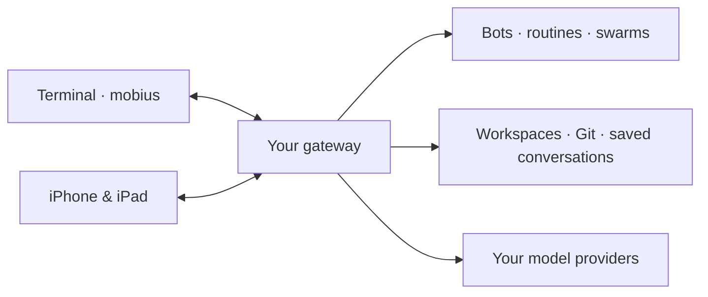

<p align="center">
  
</p>

<h1 align="center">möbius</h1>

<p align="center"><strong>One home for your agents.</strong></p>
<p align="center">Coding agents in your terminal, on your iPhone, and on your iPad.<br>Run them on your own hardware or a hosted gateway.</p>

<p align="center">
  <a href="https://github.com/citizenhicks/mobius/actions/workflows/ci.yml"></a>
  <a href="https://github.com/citizenhicks/mobius/actions/workflows/swift.yml"></a>
  <a href="https://crates.io/crates/mobius"></a>
  <a href="https://github.com/citizenhicks/mobius/blob/main/LICENSE"></a>
</p>

<p align="center">
  <a href="#get-started">Get started</a> ·
  <a href="https://mobius.thinkingsand.dev/how">User guide</a> ·
  <a href="https://github.com/citizenhicks/mobius/releases">Downloads</a> ·
  <a href="https://docs.rs/mobius/latest/mobius/">Rust API</a> ·
  <a href="https://mobius.thinkingsand.dev/">Cloud beta</a>
</p>

möbius is an open-source runtime for coding agents, with terminal and native Apple clients.
Create **Bots** with their own models, instructions, tools, and approval policies. Work with
those Bots across devices, schedule recurring jobs, or assemble a team to collaborate.
Your **gateway** runs the agents and keeps their workspaces and saved conversations together.

Underneath the apps is a small, modular Rust framework you can embed in your own software.

## What you can do

- **Pick up work across devices.** Open the same conversation from your terminal, iPhone,
  or iPad. Work continues while the gateway is running, even after you close a client.
- **Give each Bot a job.** Configure a builder, reviewer, or researcher with its own model,
  capabilities, instructions, and permissions. Each chat keeps its own transcript and workspace selection.
- **Put repeat work on a schedule.** Run a task once, at an interval, daily, weekly, or on a
  cron schedule. Each routine run starts a fresh conversation and keeps its results in run history.
- **Let Bots collaborate.** Swarms bring opted-in Bots together around a leader and a shared
  chat. Within a task, subagents can take on bounded parallel work.
- **Keep long tasks moving.** Durable checkpoints, context compaction, and searchable history
  let agents resume work and recover earlier details.
- **Choose the tools and boundaries.** Enable capabilities per Bot, add skills, review plugin
  hooks, and decide which actions require your approval.

## Get started

### 1. Install the terminal client and gateway

Install with [Homebrew](https://github.com/citizenhicks/homebrew-mobius):

```sh
brew tap citizenhicks/mobius
brew trust citizenhicks/mobius
brew install mobius-cli
# Optional Mac menu bar app (macOS 26+, Apple Silicon)
brew install --cask mobius-app
```

The CLI package installs the gateway as a dependency. To install just the gateway,
use `brew install mobius-gateway`. The current Mac app release is unnotarized;
macOS may require first-launch approval in Privacy & Security.

You can also download a **`mobius-cli` release** from [GitHub Releases](https://github.com/citizenhicks/mobius/releases).
Choose the `mobius-<version>-<target>.tar.gz` archive for your machine:

| Platform | Archive target |
| --- | --- |
| macOS, Apple Silicon | `aarch64-apple-darwin` |
| Linux, Intel / AMD 64-bit | `x86_64-unknown-linux-gnu` |

Verify the archive with `shasum -a 256 -c FILE.sha256` using its accompanying checksum file,
then extract it and put the included
`mobius`, `mobius-gateway`, and `cloudflared` executables together in a directory on your `PATH`.
The archive also includes the licenses and terminal manual pages.

<details>
<summary>Install with Cargo or build from source</summary>

Rust **1.98 or newer** is required. Install `cloudflared` separately for Quick Connect;
the Cargo package installs the two möbius commands only.

```sh
cargo install --locked mobius-cli
```

From a checkout of this repository:

```sh
cargo build --locked -p mobius-cli
cargo run --locked -p mobius-cli --bin mobius
```

See the [CLI guide](https://github.com/citizenhicks/mobius/blob/main/crates/mobius-cli/README.md)
for installation and remote connection options.

</details>

### 2. Open a workspace and connect a model

```sh
cd /path/to/your/project
mobius
```

First launch starts your local gateway in the background and opens provider setup. Connect a
provider, choose a model, and start a conversation with the default `@mobius` Bot. You can add
more Bots and change their models and capabilities later.

Built-in providers include **OpenAI, Codex, Anthropic, DeepSeek, Kimi, and OpenRouter**, plus
configurable endpoints that implement the OpenAI Responses API. Authentication and available
features depend on the provider. Use `/login` to configure one and `/bot` to edit your Bot.

On Linux, protected command execution requires **Bubblewrap**. Default Quick Connect uses
`cloudflared`, which is included in the downloadable archives.

### 3. Connect your other devices

```sh
mobius-gateway connect
```

The gateway displays an address and a single-use pairing code. In the Apple app, choose
**Use your own gateway** and enter those details. Another terminal can connect with the
`mobius pair` command shown by the gateway. Once paired, each client can open saved
conversations or work independently.

Quick Connect creates an account-free Cloudflare tunnel. Its public address changes when the
gateway restarts; the [gateway guide](https://github.com/citizenhicks/mobius/blob/main/crates/mobius-gateway/README.md)
covers stable addresses and direct TLS setup. Keep your gateway machine awake and reachable
for remote access and scheduled work.

**Apple app:** the iPhone and iPad client is currently in TestFlight beta. The
[Apple guide](https://github.com/citizenhicks/mobius/blob/main/mobius-app/apple/README.md)
explains how to build it from source.

**Prefer a hosted gateway?** [möbius Cloud](https://mobius.thinkingsand.dev/) runs the same
open-source gateway in a dedicated microVM. Cloud is currently in beta and is optional.

## How it fits together



The gateway is where files, commands, provider configuration, and agent sessions live.
Clients send requests and render the same event stream. Model requests go to the provider
you configure; changing clients preserves the agent's runtime and saved work.

| Concept | What it means |
| --- | --- |
| **Gateway** | The runtime on your Mac, Linux machine, or cloud host. It serves all your paired clients. |
| **Bot** | A reusable agent profile: purpose, model, tools, instructions, and approval policy. |
| **Chat** | A conversation with one Bot, a selected workspace, and its own durable transcript. |
| **Routine** | A scheduled task owned by a Bot. Each run gets a fresh conversation. |
| **Swarm** | A group of collaborating Bots with a leader and shared chat; each Bot keeps its own context. |

Protected execution uses **Seatbelt on macOS** and **Bubblewrap on Linux** and fails closed
if the selected sandbox is unavailable. Approval policy belongs to the Bot. **Full access**
allows shell commands to use everything available to the gateway account; file tools remain
scoped to the workspace, attached folders, and the execution’s private temporary area.
Commands receive that directory in `$TMPDIR`, shared across calls. Workspace isolation
protects sibling temporary files; full-access commands use the host filesystem. The [gateway guide](https://github.com/citizenhicks/mobius/blob/main/crates/mobius-gateway/README.md)
explains these boundaries in detail.

## Build on möbius

The [`mobius`](https://crates.io/crates/mobius) crate is the embeddable core:

```toml
[dependencies]
mobius = "0.15"
```

Compose an `AgentConfig` with a model router, sandbox, checkpoint store, and ordered
middleware stack. The core owns one linear session and model/tool loop. Your application
supplies the dependencies and consumes frontend-neutral events.

- **Bring a model:** implement `Model`, or register an existing provider with `ModelRouter`.
- **Add a capability:** implement `Middleware` to own its tools, lifecycle hooks, state,
  commands, and presentation contributions.
- **Build a frontend:** submit `protocol::Op` values and render the agent's events and
  capability catalog.
- **Choose storage and execution:** inject a `CheckpointStore` and `SandboxBackend`.

Tool results contain ordered `ContentPart` text, image, and file observations. Inject the
same `backend::session_files::SessionFileStore` into `ModelRouter` and media-capable
middleware. Images are validated and stored immutably; checkpoints hold references,
and model requests resolve their bytes without changing earlier observations. Use
`view_image` with an `images` array of paths or authorized `file_id` values, and
`send_artifact` to publish a stored reference. The CLI shows image metadata; the Apple
app provides previews.

Optional `ComputerControl` runs Chromium on macOS and Linux through a persistent,
sandbox-owned JavaScript worker. Enabling `computer_control` on a Bot downloads its
pinned Node/Playwright runtime automatically, including Chromium. Both Cargo and
native-app installations use this gateway-managed setup; no system Node installation
is needed. Runtime revisions live beside protected gateway state, normally under
`~/.mobius/gateway-runtimes/computer-control`. A failed setup leaves the Bot unchanged;
retry enabling the capability after resolving the reported error. Deployments that
supply their own complete runtime can set `MOBIUS_COMPUTER_RUNTIME` to its absolute
directory. Linux hosts still need Chromium's system libraries and Bubblewrap.

On macOS, the same worker's `desktop` API controls native apps through the existing
menu bar app connection: accessibility inspection and actions, screenshots, app
activation, mouse input, and keyboard input. Enable **Allow Mac control** in the
menu bar, grant macOS Accessibility and Screen Recording permissions, and select
the Bot's **Full access** sandbox policy. Stop, disconnect, or an inactive desktop
session revokes control. The gateway remains the sole agent and approval owner.
Headless cloud gateways keep browser control only.

Browser state survives compaction. An overall evaluation deadline, cancellation,
reset, or runtime restart loses interpreter state. Action timeouts can retain state;
follow the reported status and never automatically repeat an uncertain action.
The worker uses the same sandbox
approval, filesystem, network, and process cleanup policy as commands: Seatbelt on
macOS and Bubblewrap on Linux.

Start with the [compile-checked composition example](https://docs.rs/mobius/latest/mobius/#embedded-composition)
and [API documentation](https://docs.rs/mobius/latest/mobius/). The gateway is the shipped
composition root; the CLI and Apple app contain client behavior and presentation.

Extensions support standalone **Agent Skills** and **OpenAI-format plugins** with skills and
command hooks. Installed packages are inactive until selected for a Bot or its creation
template, and executable hooks require review of the installed package digest. MCP and app
connectors are not yet supported.

| Package | Role |
| --- | --- |
| [`mobius`](https://crates.io/crates/mobius) | Embeddable Rust agent framework. |
| [`mobius-gateway`](https://crates.io/crates/mobius-gateway) | Headless runtime library: authentication, Bots, chats, routines, and swarms. |
| [`mobius-cli`](https://crates.io/crates/mobius-cli) | Installs the `mobius` terminal client and `mobius-gateway` executable. |
| [Apple app](https://github.com/citizenhicks/mobius/tree/main/mobius-app/apple) | Native SwiftUI client for iPhone and iPad. |

## Documentation and contributing

| Start here | For |
| --- | --- |
| [User guide](https://mobius.thinkingsand.dev/how) | Setup, everyday workflows, Bots, and settings. |
| [Terminal manual](https://mobius.thinkingsand.dev/manual) | Command reference and manual pages. |
| [CLI guide](https://github.com/citizenhicks/mobius/blob/main/crates/mobius-cli/README.md) | Installation, provider setup, and terminal controls. |
| [Gateway guide](https://github.com/citizenhicks/mobius/blob/main/crates/mobius-gateway/README.md) | Hosting, pairing, authentication, and sandbox policy. |
| [Bots and context](https://github.com/citizenhicks/mobius/blob/main/crates/mobius-gateway/BOTS.md) | Routines, swarms, subagents, and memory boundaries. |
| [Apple guide](https://github.com/citizenhicks/mobius/blob/main/mobius-app/apple/README.md) | Building and testing the iPhone and iPad app. |

Contributions and [issue reports](https://github.com/citizenhicks/mobius/issues) are welcome.
Read [AGENTS.md](https://github.com/citizenhicks/mobius/blob/main/AGENTS.md) for module ownership,
design rules, and required checks.

The Rust packages have separate versions and release workflows. See
[release instructions](https://github.com/citizenhicks/mobius/blob/main/AGENTS.md#releases)
and the [release workflow](https://github.com/citizenhicks/mobius/blob/main/.github/workflows/release.yml).

## License

[Apache-2.0](LICENSE). See [NOTICE](NOTICE) for third-party attributions.
