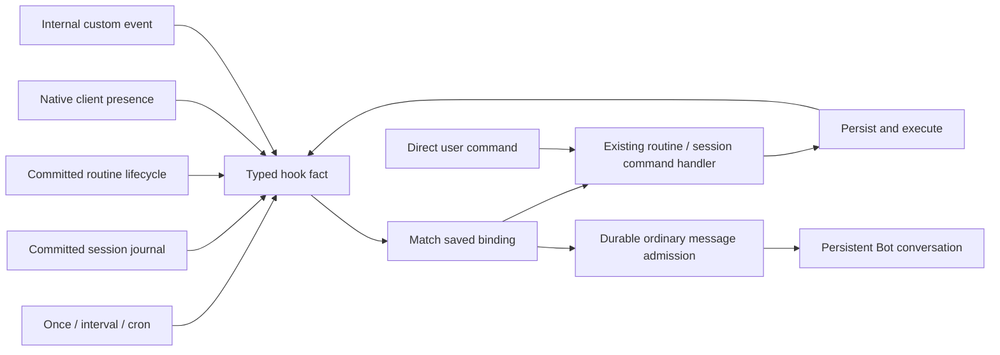

# Persistent Bot conversation and shared hooks

Implemented for core/gateway/CLI 0.16.0, desktop 0.3.0 and iOS 0.10.0.

## Conversation ownership

Each Bot exposes one deterministic `conversation_session_id`. The gateway lazily opens it through the existing session host, agent admission, checkpoint, transcript, replay and client selection paths. It has no logical project workspace. Its private execution directory sits outside protected gateway state and is not exposed as a project. Project instructions, coding tools and workspace operations are absent; stored attachments and ordinary history remain available. Generic session rename, hide, reassignment and deletion cannot replace this canonical conversation. Bot deletion owns its cascade.

One mandatory gateway middleware, `persistent_chat`, owns the main-chat instructions and six tools: routine listing/scheduling/commands, subscription listing/editing and internal custom event emission. Its TOML owns editable text. Assembly includes it only for the canonical main chat and captures the ordinary child template before installing it. Ordinary chats, forks, routine runs and subagents cannot enable it through Bot settings.

Shared `message_chat` handles queued or steering messages and interruption of a selected turn. A workspace instead of a target creates a new project chat and delivers its first task. `list_chats` exposes active turn IDs. Creation and interruption require a user-authored turn; source reports retain only existing coordination permissions. Saved session hooks reuse the ordinary message/interrupt protocol and default to queued delivery.

User turns can authorize management. Gateway-authored Source turns can inspect history and summarize results, but cannot create routines, modify subscriptions or send new work. The initiating author survives checkpoints, execution history, restart and compaction. Tool exposure and actual execution both enforce this rule; prompt text is not the authority boundary.

## One hook and command mechanism

`HookEvent` is a fact. `BotAction` is the saved command issued by a matched `HookBinding`. Both carry stable identity and gateway-established origin; events carry time, cause and bounded causal ancestry. Native clients use gateway protocol 88. There is no second automation transcript, agent registry or scheduler.

| Owner | Typed events |
| --- | --- |
| Routine definition | `routine.created`, `routine.updated`, `routine.paused`, `routine.resumed`, `routine.deleted` |
| Routine invocation | `routine.run.started`, `routine.run.finished` with succeeded/failed/cancelled, `routine.run.skipped` |
| Clock | `schedule.due`, addressed to the exact owning routine and binding |
| Session | `session.created`, `session.turn.started`, `session.turn.finished` with the existing execution outcome, `session.approval`, `session.deleted`, `session.owner_changed` |
| Client | `client.connected`, `client.disconnected`, aggregated across the native client's sockets |
| Bot custom input | `custom.received`, with a bounded JSON payload and gateway-established Bot source |

A routine owns `RoutineDefinition { workspace, instructions, bindings }`. The standalone schedule field has been removed. Each binding selects a typed event and issues a typed command against its owning routine. Direct user requests, timers and matched hooks all enter the same routine command handler:

| Command | Behavior |
| --- | --- |
| Start | Request one invocation through shared eligibility, overlap, persistence and runner |
| Stop | Cancel the specified active `run_id`; the terminal event confirms completion |
| Pause | Disable future starts while an active run finishes |
| Resume | Re-enable starts and schedule the next occurrence without replaying missed timers |
| Update | Replace a validated editable definition, preserving Bot ownership; rejected while running |
| Delete | Use the existing owned cleanup and cascade |

Pause does not disable event matching, so an event can resume a paused routine. Repeated pause/resume and unchanged updates emit no extra fact. A Bot subscription uses the same selector/action model to report to the main conversation, issue an owned routine command or message/interrupt another owned visible session. Session actions reuse the existing `Op::Message` and `Op::Interrupt` records. Subagent and sibling-session messaging use the same neutral `MessageAuthor::Source` and durable admission, rather than another message protocol.

## Persistence and trust boundaries

Routine changes, run outcomes, hooks and matching outbox entries share the existing Bot SQLite transaction. Non-start accepted commands acknowledge the outbox in that state-change transaction; start uses a stable command reservation. Session projection resumes in journal order from durable per-source cursors. Final deletion and reassignment facts cancel obsolete pending authorization while retaining explicitly matched final actions. A small checkpoint-owned deletion intent closes the cross-database crash window, and is recovered before serving clients.

Each accepted Source submission receives a checkpoint-owned durable receipt in the same transaction as admission. A retry after queue consumption or a gateway crash cannot enqueue duplicate work. Queued reports use ordinary chat history, attention and replay. Receipts acknowledge admission, not successful model completion.

Actions are deduplicated by event and binding identity. Causal ancestry is bounded at 16; terminal facts at the bound remain publishable but cannot authorize another action. Revisited causes and no-op state changes suppress cycles. Binding edits, disablement, deletion and source ownership changes revoke unaccepted actions. The gateway rechecks ownership and saved authorization at actual admission, using the existing mutation lease.

Only Bot custom input accepts arbitrary bounded JSON. Typed validation precedes persistence. Built-in lifecycle facts cannot be forged through Bot input.

New event-worker SQLite work runs on the blocking pool while retaining admission guards through caller cancellation. Client presence persists in first/last socket order before registration or drop completes. Existing synchronous Bot storage remains the owner; no storage adapter was added.

## Client seams and appearance

CLI, macOS and iOS open the canonical conversation through ordinary session selection. They preserve typed event bindings when editing schedules, including manual-only definitions. Typed hook invalidation refreshes the existing routine/history/catalog records. The centered Bot rail uses existing Bot identity and activity; the persistent header contains the face and glass name pill, with a glass three-dot control at the right. Composer identity pills have been removed. Default dark background is `#181818`; macOS uses a compact transparent header and iOS shares appearance overrides. Concurrent Bot face changes are preserved.

New gateway/Bot profiles default to Full Access. Existing explicit profiles keep their settings. Desktop and iOS issue one normal information toast per gateway when the actual Ready/configuration confirms Full Access; the remembered flag survives reconnect and restart.

## Gaps against the requested foundation

The requested shared typed event/binding/command foundation is implemented for routines, sessions, native clients and Bot custom input. The original separate clock-to-run path and peer-only message provenance have been consolidated. Source-triggered reporting is deliberately read/report-only; saved typed actions carry the user's earlier mandate.

Cloud APNs delivery continues to derive session notifications from the existing durable catalog/attention projection; the shared typed hook stream is available, but this release does not replace that notification transport with a second durable hook replay API.

Execution suspension is not provided: pause controls future routine starts, and stop interrupts a specific invocation. Durable hook replay is gateway-owned; clients consume typed invalidation plus ordinary chat replay rather than a second client event-history API. No wildcard selectors, arbitrary command graphs or projectless parallel agent runtime were added.

This release changes strict persisted schemas: Bot SQLite 3→6/catalog 6→7, core SQLite 10→11/checkpoint 17→18, and gateway ChatSpec 14→15. Runtime compatibility/migration code remains absent. Existing cloud state is converted by a separate stopped-service operator script with verified private backups before 0.16.0 startup.
